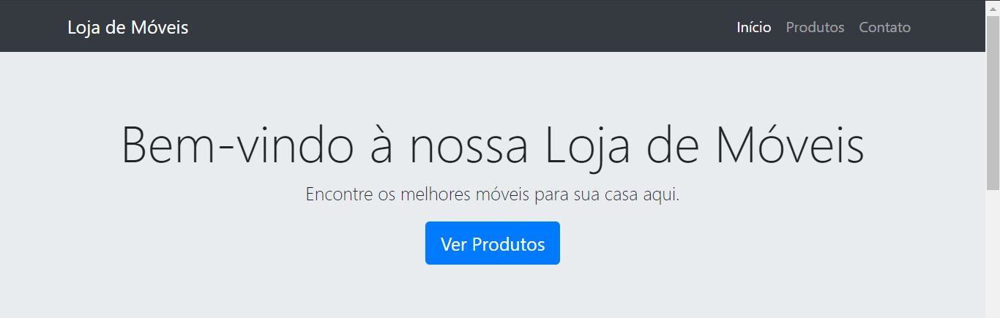
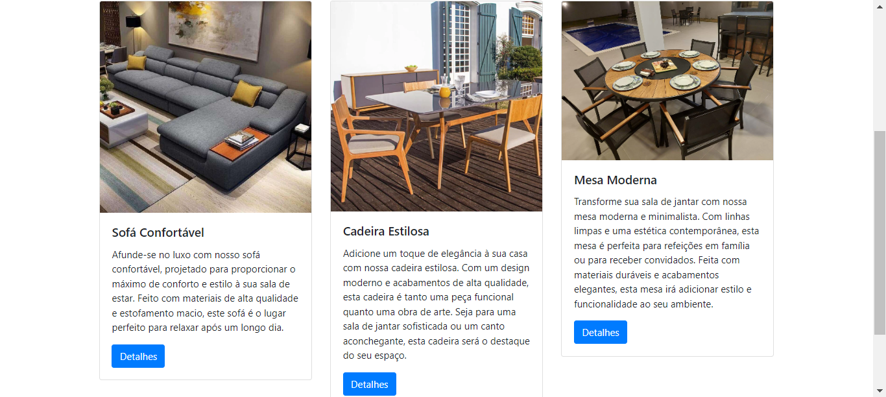

# LOJA DE MOVEIS
👨‍🏫PROJETO DE INTERFACE CRIADO COM LARAVEL E BOOTSTRAP.

 <br> 
 <br> 
 <br> 

## DESCRIÇÃO:
- O projeto é um exemplo simples de um site de móveis desenvolvido com o framework Laravel. Ele apresenta uma página inicial com uma barra de navegação, um banner de boas-vindas e uma seção de produtos com cards de sofá, cadeira e mesa. Este projeto demonstra como criar e renderizar páginas usando templates Blade do Laravel, definir rotas, criar controladores e estilizar o conteúdo com CSS Bootstrap.

- Este projeto serve como um ponto de partida simples para aprender os conceitos básicos do desenvolvimento web com Laravel e pode ser expandido e personalizado de acordo com suas necessidades e habilidades.

## EXECUTANDO O PROJETO:
1. **Instalando Dependências:**
   Navegue até o diretório do projeto clonado e execute o comando abaixo para instalar todas as dependências listadas no arquivo `composer.json`:
   ```
   composer install
   ```

2. **Executando o Servidor Embutido:**
   Após a instalação das dependências, inicie o servidor embutido do PHP executando o seguinte comando:
   ```
   php artisan serve
   ```

3. **Acessando o Site:**
   Abra um navegador da web e navegue até o endereço `http://localhost:8000` para visualizar o site. Você será recebido com a página inicial do `Loja de Moveis`, onde poderá explorar os produtos e navegar pela barra de navegação.

## NÃO SABE?
- Entendemos que para manipular arquivos em `HTML`, `CSS` e outras linguagens relacionadas, é necessário possuir conhecimento nessas áreas. Para auxiliar nesse aprendizado, oferecemos cursos gratuitos disponíveis:
* [CURSO DE HTML E CSS](https://github.com/VILHALVA/CURSO-DE-HTML-E-CSS)
* [CURSO DE LARAVEL](https://github.com/VILHALVA/CURSO-DE-LARAVEL)
* [CURSO DE BOOTSTRAP](https://github.com/VILHALVA/CURSO-DE-BOOTSTRAP)
* [CONFIRA MAIS CURSOS](https://github.com/VILHALVA?tab=repositories&q=+topic:CURSO)

## CREDITOS:
- [PROJETO CRIADO PELO VILHALVA](https://github.com/VILHALVA)


